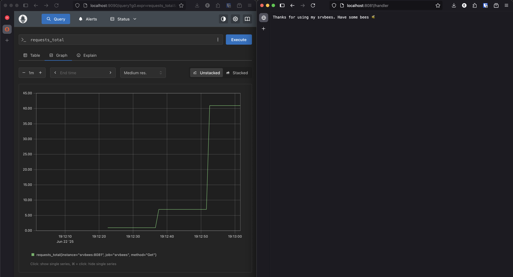

# srvbees 🐝

Very simple service exporting metrics to Prometheus.

## Running

You only need `docker` to try this out. Commands for building and running the
service and prometheus are in the `.justfile`.
